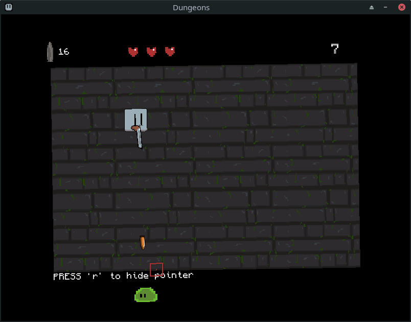

    

<h1 align="center"> DUNGEON</h1>

    

## Plot

You came to explore a dungeon in the heart of a big jungle. As you entered the dungeon, the stone gates behind you closed, you trapped. Now you are been attacked by smiles. You are only equipped with a revolver and you have three lives. What would you do?

## About

This game is made with [LOVE2D game framework](https://love2d.org/). For the moment, I have just built this for linux.

## Requirments

You will be needing LOVE2D to run this game. [Download the luancher](https://love2d.org/).

## Installation

### linux

Download the repository and run the code below in the respective game folder.

`sh run.sh`

## Controls
Move - WASD or Arrow keys
Shoot - Left mouse button
Show/Hide pointer - R
